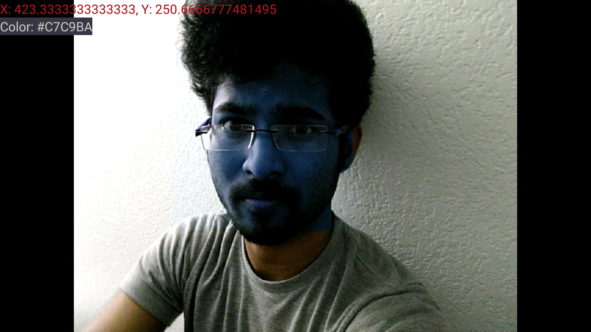

## Features:
Thus the features can be summarized as follows:
	1. Face detection with real time adaptive filter effect using color detection.
	2. Face Detection with face-only filter.
	3. Real time Encrypt/password protect using color detection. 
### Objective and Applications:
The main objective of our app is to use the on Touch color detection for practical real time-purposes.  
1. Face-detection:													
(1a) On such purpose could be a adaptive filter effect-as of instagram and other such social media. Our feature differs from the naive filters as in, the filters used are generally limited and controlled by the application designers. In our app, it is possible to create filters on-the-go just by clicking on a color on camera interface, providing virtually a broader range of filters.

 (1b) Other implementation of face detector would be changing the color of the face alone keeping remaining portion of the image constant. This is what we actually see in DSLR imaging techniques. In our app, we made a "Avatar"(blue) filter.

2. Password/Encryption:
Other purpose could be using the touch color detection to encrypt/ store the passwords within an image. In general, most of the people use pattern,PIN as passwords, which can be easily hacked. We implemented an idea of such locking implementation using color. Our app has an interface to train, wherein the user is asked to pick random color points from the camera interface or of static colored image with different colors. The touched color, hue, saturations for those  points are stored in a database. When the user, at a later time picks the same colors either from camera interface/static image, they are compared against the database and authenticated. All it requires for the user is to remember the sequence of colors for the password. For better accuracies we stick with static images. 

### Running the app:
Run the app:
 1. On a phone connected by a USB cable(Recommended).(Or)
 2. On a phone by copying apk-debug from the directory \app\build\outputs\apk\apk-debug.apk
 	into the phone.
 3. Arm v7 Emulator(Very very slow and not recommended). 
The app doesn't run on the x86 emulator due to jni issues for opencv face detector. We really tried to deal this issue, but given the time we were unable to.(We have to leave Face detection feature to make it compatible with x86 emulator). However, it runs fine on a ARM v7 compatible emulator or a mobile phone.

Note: The app runs on landscape mode only. Face detection does not work in portrait mode.
		Give the permissions for the app-both for storage and camera in app settings.

### Using the app:
Once the app is installed, you are provided with three buttons feature1,feature2,feature3. Clicking on each button leads to corresponding activity.
feature1: Point the camera towards a face, now click on any random color you like on the camera interface. The screen turns into that corresponding colored filter.
Feature2: Point the camera towards a face, you can see that only the face color of the person changes to blue.
Feature3:   You are provided with series of colored images. 
			--Click on train, Toast appears, saying select the pattern. Click on any color for 5 times.
			--CLick on unlock, Select the 5 color patters on the same image. Within 7-8 tries, the databse matches the touched colors, identifies the user and 	    displays a toast-saying whether pattern is matched or not. If the user is matched, the hidden file from the storage appears on the screen. If user is not matched, the file is not opened.
	

### Screenshots

